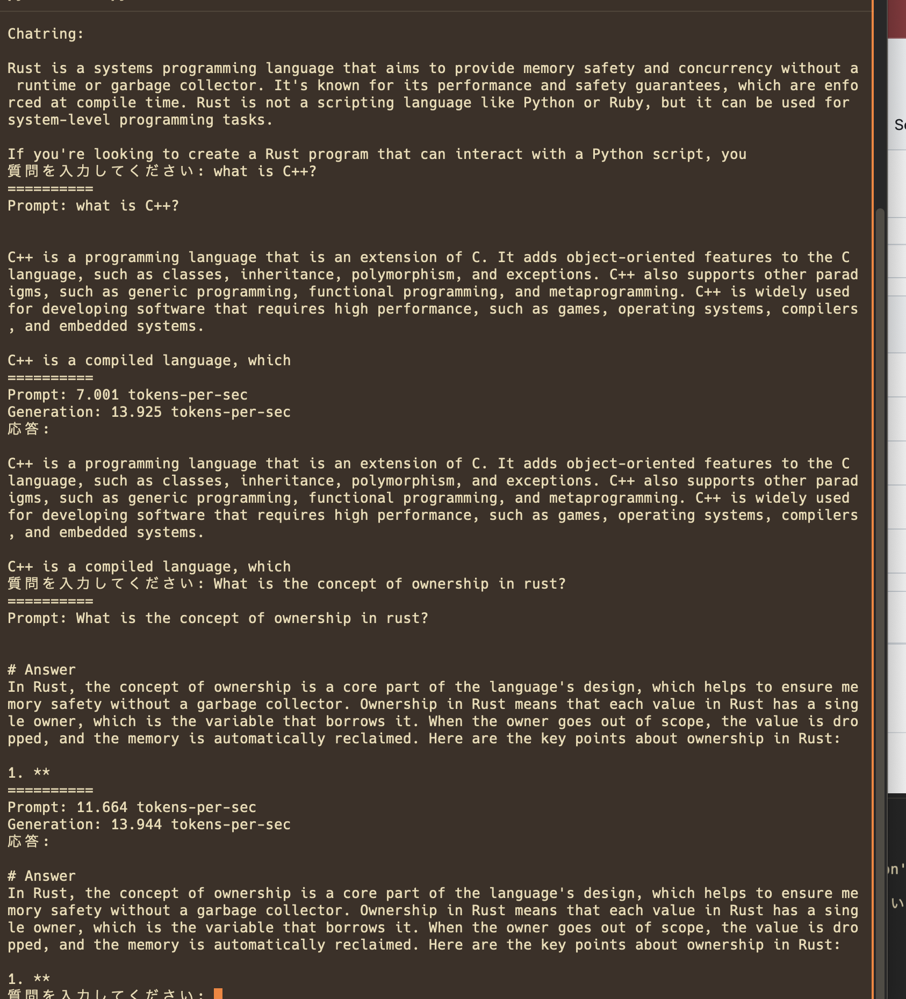

# Phi-3-mini-128k-instruct-4bit on mac
これはm1 macbookでSLM(Phi-3-mini-128k-instruct-4bit)を動かすデモです

## 手順
1. これをlocalにcloneする
2. git clone `https://huggingface.co/mlx-community/Phi-3-mini-128k-instruct-4bit`
3. `conda env create -f environment.yml`

## reference
[Phi-3-mini-128k-instruct-4bit](https://huggingface.co/mlx-community/Phi-3-mini-128k-instruct-4bit)
